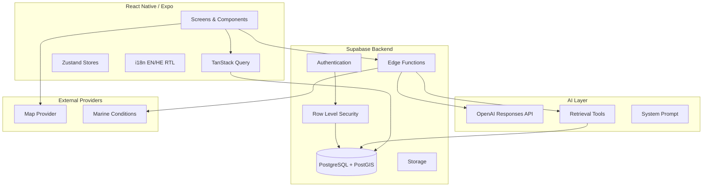

# FishGuide AI

An intelligent fishing assistant mobile app that combines verified location data, species information, equipment recommendations, environmental conditions, regulations, and an AI fishing guide.

## Architecture



## Technology Stack

| Layer | Technology |
|-------|-----------|
| Mobile | React Native, Expo 57, TypeScript strict |
| Navigation | Expo Router |
| State | TanStack Query, Zustand |
| Forms | React Hook Form + Zod |
| Backend | Supabase (PostgreSQL, PostGIS, Auth, RLS, Edge Functions) |
| AI | OpenAI Responses API via Edge Function |
| Maps | react-native-maps (abstracted for provider swap) |
| i18n | i18next (English + Hebrew RTL) |

## Prerequisites

- Node.js 20+
- npm or yarn
- Expo CLI (`npx expo`)
- Supabase CLI (for local backend)
- EAS CLI (for production builds)

## Installation

```bash
cd fishguide-ai
npm install
cp .env.example .env
```

## Local Development (Mock Mode)

The app runs fully in mock mode without external services:

```bash
# Ensure .env has:
# EXPO_PUBLIC_USE_MOCK_DATA=true

npm start
```

Press `w` for web, scan QR for Expo Go, or run `npm run android` / `npm run ios`.

### Mock mode includes

- 8 demonstration Israeli Mediterranean fishing spots
- 15 species entries
- Equipment recommendations
- Environmental conditions (mock provider)
- AI chat responses (client-side mock)
- Trip and catch log (local state)

A visible **DEMO** badge appears when mock data is shown.

## Supabase Setup

1. Create a Supabase project at [supabase.com](https://supabase.com)
2. Install CLI: `npm install -g supabase`
3. Link project: `supabase link --project-ref YOUR_REF`
4. Run migrations:

```bash
supabase db push
# or locally:
supabase start
supabase db reset
```

5. Load seed data:

```bash
psql $DATABASE_URL -f supabase/seed.sql
```

6. Update `.env`:

```env
EXPO_PUBLIC_SUPABASE_URL=https://YOUR_PROJECT.supabase.co
EXPO_PUBLIC_SUPABASE_PUBLISHABLE_KEY=your-anon-key
EXPO_PUBLIC_USE_MOCK_DATA=false
```

## Edge Functions

Deploy and configure secrets:

```bash
supabase secrets set OPENAI_API_KEY=sk-...
supabase secrets set OPENAI_MODEL=gpt-4.1-mini
supabase secrets set MARINE_CONDITIONS_PROVIDER=mock

supabase functions deploy fishing-assistant
supabase functions deploy marine-conditions
supabase functions deploy account-delete
supabase functions deploy trip-notifications
```

### Local Edge Function testing

```bash
supabase functions serve fishing-assistant --env-file supabase/.env.local
```

## Configuring OpenAI

- Set `OPENAI_API_KEY` as a Supabase secret (never in the mobile app)
- Set `OPENAI_MODEL` as a Supabase secret (single config point)
- The fishing-assistant function uses the Responses API with structured JSON output and tool calling

## Configuring Maps

Default: `react-native-maps` (no token required for basic usage).

For Mapbox or other providers, implement a new provider in `components/map/MapProvider.tsx` and set:

```env
EXPO_PUBLIC_MAP_PROVIDER=mapbox
EXPO_PUBLIC_MAP_TOKEN=your-token
```

## Marine Conditions Provider

Set `MARINE_CONDITIONS_PROVIDER=mock` for development.

For production, implement the HTTP adapter in `supabase/functions/marine-conditions/index.ts` and set:

```bash
supabase secrets set MARINE_CONDITIONS_PROVIDER=http
supabase secrets set MARINE_CONDITIONS_API_KEY=your-key
```

## Running Tests

```bash
npm test
npm run typecheck
```

## EAS Builds

```bash
npm install -g eas-cli
eas login
eas build:configure
eas build --platform ios --profile preview    # TestFlight prep
eas build --platform android --profile preview  # Internal testing
```

## Project Structure

```
app/           Expo Router screens
components/    UI components (common, map, fishing, chat)
features/      Business logic by domain
lib/           API, auth, config, i18n, validation
stores/        Zustand stores
types/         Shared TypeScript types
supabase/      Migrations, seed, Edge Functions
tests/         Unit and integration tests
docs/          Additional documentation
```

## Security & Threat Model

### Threats mitigated

- **Secret exposure**: OpenAI and service-role keys exist only as Supabase secrets
- **Unauthorized data access**: RLS on every table; users access only their own favorites, trips, catches, chats
- **Role escalation**: Roles stored server-side; client cannot set admin role
- **Rate abuse**: Edge Function rate limiting by user ID and IP
- **AI hallucination**: Retrieval-first architecture; structured output validation; confidence labeling

### Residual risks

- Demo data must not be deployed as verified production data
- Regulation data requires periodic manual verification
- Community reports need moderator review before affecting public data

## Known Limitations

- Map clustering not yet implemented for very large spot datasets
- Fish photo identification is placeholder only
- Streaming AI responses use full response in v1 (SSE structure ready in Edge Function)
- Admin UI is functional but basic; full CRUD forms require Supabase connection

## Production Checklist

- [ ] Set `EXPO_PUBLIC_USE_MOCK_DATA=false`
- [ ] Configure Supabase project with migrations and seed review
- [ ] Set OpenAI and marine provider secrets
- [ ] Configure EAS project ID in app.json
- [ ] Set up trip-notifications cron job in Supabase
- [ ] Review and replace demo regulation data
- [ ] Privacy policy and terms of service
- [ ] App Store / Play Store privacy declarations

## Documentation

- [Database Schema](docs/DATABASE_SCHEMA.md)
- [AI Architecture](docs/AI_ARCHITECTURE.md)
- [Data Verification Policy](docs/DATA_VERIFICATION.md)
- [Admin Workflow](docs/ADMIN_WORKFLOW.md)
- [External Providers](docs/EXTERNAL_PROVIDERS.md)
- [App Store Privacy](docs/APP_STORE_PRIVACY.md)
- [Implementation Status](docs/IMPLEMENTATION_STATUS.md)
